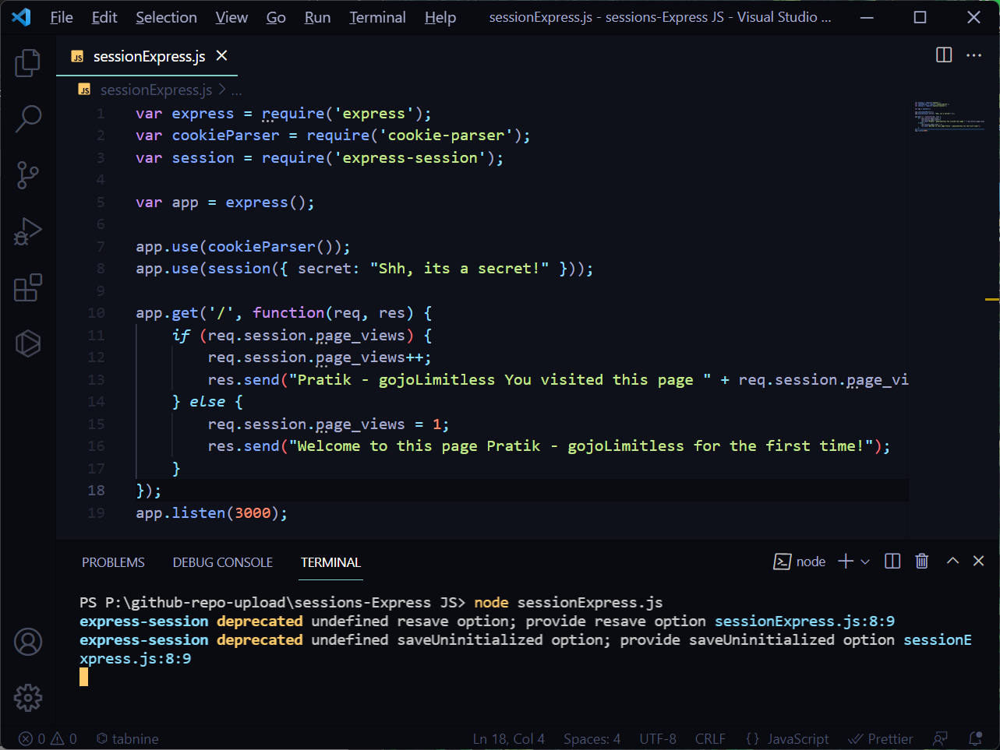
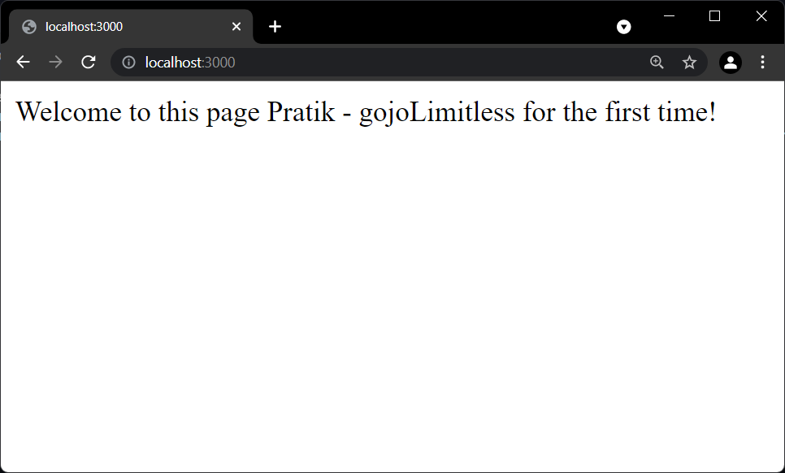
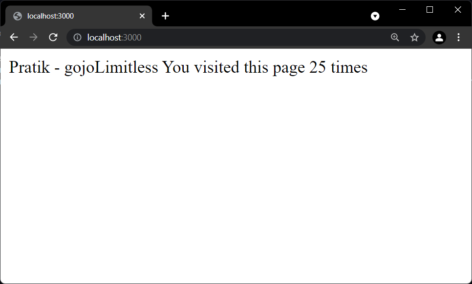

# session-Express.js
**A which demonstrate Session handling in Express.js**

HTTP is stateless; to associate a request to any other request, you need 
a way to store user data between HTTP requests. Cookies and URL parameters 
are both suitable ways to transport data between the client and the server. But 
they are both readable and on the client side. Sessions solve exactly this 
problem. You assign the client an ID and it makes all further requests using that 
ID. Information associated with the client is stored on the server linked to this 
ID.

We will put the session and cookie-parser middleware in place. In this example, 
we will use the default store for storing sessions, i.e., MemoryStore. Never use 
this in production environments. The session middleware handles all things for 
us, i.e., creating the session, setting the session cookie and creating the session 
object in req object.
Whenever we make a request from the same client again, we will have their 
session information stored with us (given that the server was not restarted). 
We can add more properties to the session object. In the following example, 
we will create a view counter for a client.

What the above code does is, when a user visits the site, it creates a new session 
for the user and assigns them a cookie. Next time the user comes, the cookie is 
checked and the page_view session variable is updated accordingly.

**For running this program we need to install the following**
1. npm install -g npm
2. npm install --save express-session
3. npm install express --save
4. npm install cookie-parser
5. node sessionExpress.js(to run)

Now if you run the app and go to localhost:3000, the following output 
will be displayed.

If you revisit the page, the page counter will increase. The page in the following 
screenshot was refreshed 8 times.

**_Thus, session handling is performed in Express._**

